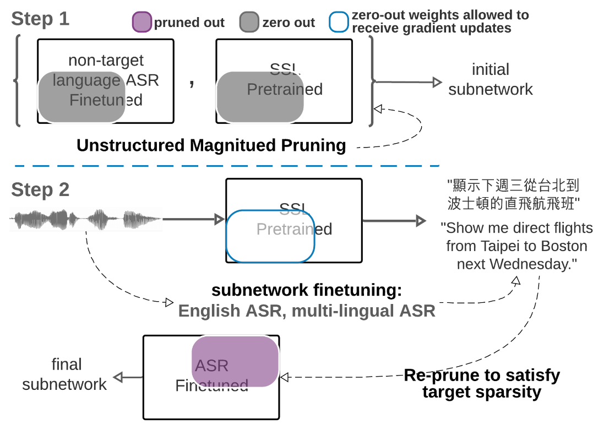

# PARP 
## Prune, Adjust and Re-Prune for Self-Supervised Speech Recognition

The PARP paper presented a simple and efficient pruning method for sparse subnetwork discovery from self-supervised pre-trained initializations (wav2vec 2.0/XLSR-53) that can be finetuned to the same downstream low-resource ASR results. The authors have conducted extensive experiments in various speech related tasks to demonstrate the algorithm's effectiveness in performing better with pruning and finetuning pretrained models

<p align="center">

</p>

1. Language-Agnostic Initial Subnetwork - Directly prune pre-trained SSL such as wav2vec2/XLSR at target sparsity, and obtain an initial subnetwork and an initial pruning mask. Alternatively, prune a non-target language finetuned wav2vec2/XLSR.
2. Language-Aware Subnetwork Adjustment - Finetune the initial subnetwork on target downstream task/language. During finetuning, zero out the pruned weights specified by the pruning mask, but allow the weights be updated by gradient descent during backpropogation. After a few number of model updates, re-prune the updated subnetwork at target sparsity again.

One of the experimental limitations as mentioned in the paper is that their experiments are on relatively large pre-trained models (315M parameters for wav2vec2-large and xlsr). So, it would be interesting to investigate if small pre-trained models can also be pruned and whether the observation holds for them

In this hacker role, we explore this idea and try to perform the pruning + finetuning on two models -
1. [whisper-tiny](https://huggingface.co/openai/whisper-tiny) - 37.8 M parameters
2. [wave2vec-base](https://huggingface.co/facebook/wav2vec2-base-960h) - 94.4 M parameters 

## Instructions
- Download the TIMIT dataset from [here](https://figshare.com/articles/dataset/TIMIT_zip/5802597), untar it, and extract it in `data` directory
- Set up your huggingface login token (with write permissions) and use it when prompted during running the code
- The notebooks  - `parp.ipynb` and `whisper_tiny.ipynb` contain the pipeline starting from pruning the models to training them, for `wav2vec-base` and `whisper-tiny` respectively
- The training took too much time, so you can run the python scripts for training as -
    ```
    huggingface-cli login --token $HUGGINGFACE_TOKEN --add-to-git-credential
    ```
    ```
    python3 train.py
    ```
    `train.py` is for wav2vec-base and `w_train.py` for whisper-tiny
- Note that converting the pipeline to whisper took significant effort because authors initially used wav2vec models, and still during last eval step in re-training, the tokenizer's batch-decode fails
- The detailed result for `wav2vec-base` can be seen on https://huggingface.co/atishayj25/parp-wave2vec, where the final version got **0.34** WER after 2500 steps

## Pruning Method
- In the paper, they discovered that subnetworks identified through both task-specific and task-agnostic pruning methods share significant similarities in certain aspects. 
- Specifically, they used different initialization techniques for different scenarios, such as using MPI on wav2vec2 and xlsr or OMP on a different spoken language for H2L and CSR, and MPI on wav2vec2 for LSR.
- We used `pruning_method = prune.L1Unstructured` for pruning which means prune (currently unpruned) units in a tensor by zeroing out the ones with the lowest L1-norm, that is just using unstructured magnitude pruning as mentioed in the image above.

## Dataset 
The Dataset which we used for training is [TIMIT](https://huggingface.co/datasets/timit_asr), which is a corpus of read speech designed to provide speech data for acoustic-phonetic studies and for the development and evaluation of ASR systems. The [Timit dataset](https://catalog.ldc.upenn.edu/LDC93S1) can be downloaded from [here](https://figshare.com/articles/dataset/TIMIT_zip/5802597)

## References
- [PARP Paper](https://arxiv.org/pdf/2106.05933)
- Authors : Cheng-I Jeff Lai1, Yang Zhang, Alexander H. Liu, Shiyu Chang, Yi-Lun Liao, Yung-Sung Chuang, Kaizhi Qian, Sameer Khurana, David Cox, James Glass
- https://people.csail.mit.edu/clai24/parp/
- For code - [parp github](https://github.com/jefflai108/PARP-wav2vec-PyTorch) and [demo](https://colab.research.google.com/drive/1onydMil8ulrdPY1LDxWbr2F_oWAENEEp)
