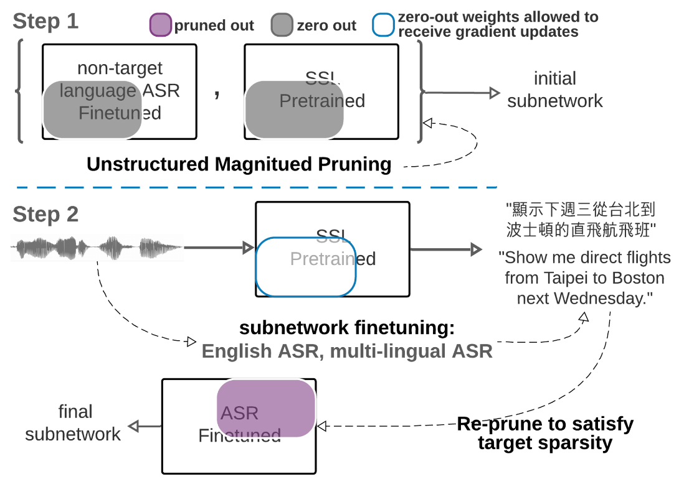

# PARP 
## Prune, Adjust and Re-Prune for Self-Supervised Speech Recognition

The PARP paper presented a simple and efficient pruning method for sparse subnetwork discovery from self-supervised pre-trained initializations (wav2vec 2.0/XLSR-53) that can be finetuned to the same downstream low-resource ASR results. The authors have conducted extensive experiments in various speech related tasks to demonstrate the algorithm's effectiveness in performing better with pruning and finetuning pretrained models



One of the experimental limitations as mentioned in the paper is that their experiments are on relatively large pre-trained models (number of parameter is 90M for wav2vec2-base and 315M for wav2vec2-large and xlsr). So, tt would be interesting to investigate if small pre-trained models can also be pruned and whether the observation holds for them

In this hacker role, we explore this idea and try to perform the pruning + finetuning on two models -
1. whisper-tiny - 
2. wave2vec-base - 

## Instructions
- Download the TIMIT dataset from [here](https://figshare.com/articles/dataset/TIMIT_zip/5802597), untar it, and extract it in `data` directory
- Set up your huggingface login token (with write permissions) and use it when prompted during running the code
- The notebooks 
- The training can take too much time, you can run the python scripts for training as -
    ```
    huggingface-cli login --token $HUGGINGFACE_TOKEN --add-to-git-credential
    python3 train.py
    ```

## Results
- 

## Dataset 
The Dataset which we used for training is [TIMIT](https://huggingface.co/datasets/timit_asr), which is a corpus of read speech designed to provide speech data for acoustic-phonetic studies and for the development and evaluation of ASR systems. The [Timit dataset](https://catalog.ldc.upenn.edu/LDC93S1) can be downloaded from [here](https://figshare.com/articles/dataset/TIMIT_zip/5802597)

## References
- [PARP Paper](https://arxiv.org/pdf/2106.05933)
- Authors : Cheng-I Jeff Lai1, Yang Zhang, Alexander H. Liu, Shiyu Chang, Yi-Lun Liao, Yung-Sung Chuang, Kaizhi Qian, Sameer Khurana, David Cox, James Glass
- https://people.csail.mit.edu/clai24/parp/
- For code - [parp github](https://github.com/jefflai108/PARP-wav2vec-PyTorch) and [demo](https://colab.research.google.com/drive/1onydMil8ulrdPY1LDxWbr2F_oWAENEEp)